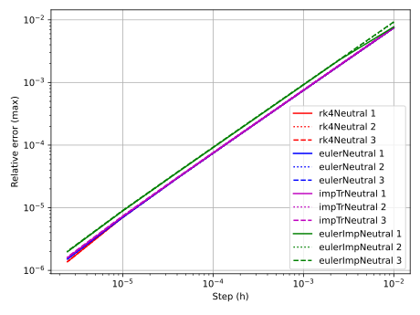
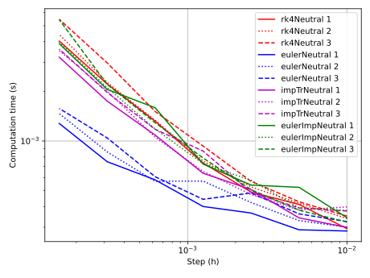
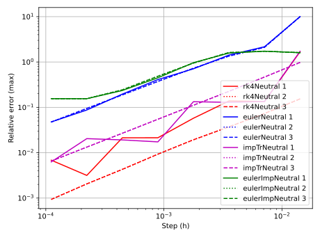
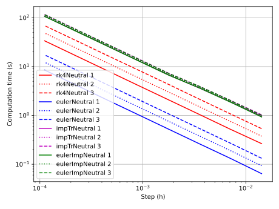

# Benchmark

## bellen.c

The function f is polynomial, but the derivative of solution is not continuous. As a result, all the proposed methods converge at the same speed

Therefore the computation time is in favour of the most simple one: explicit Euler method with interpolation order 1.

## stateArt.c

The function f is polynomial only C1, but the solutions are regular. As a result, all the proposed methods converge at the same speed

Therefore the computation time is in favour of the most simple one: explicit Euler method with interpolation order 1.

Remarks: 
* eulerNeutral has a tendency to add energy to the system, it can therfore diverge for small values of h
* eulerImpNeutral is very stable, and has a tendency to stay close to the zero solution for small values of h
* imptTr are bad only because of a delay in the phase of the solution.
