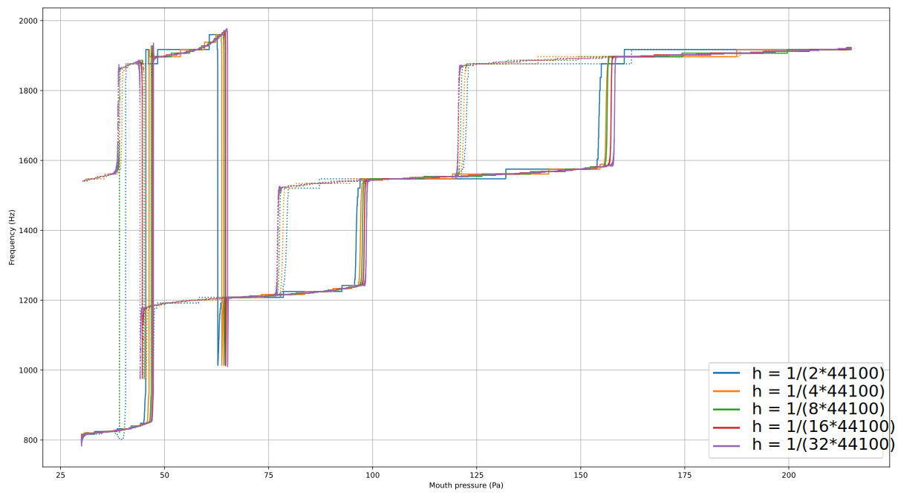

# stateArt
example taken from "Calculation of the Steady-State Oscillations of a Flute Model Using the Orthogonal Collocation Method "

by  Terrien, S.; Vergez, C.; Fabre, B.; Barton, D.

https://doi.org/10.3813/AAA.918748

Hereafter is given a simulation for different time step for an increasing ramp from 30 to 200 Pa in 10s (full curves), followed by a decreasing ramp from 200 to 30 Pa in 10s (dotted curves).

